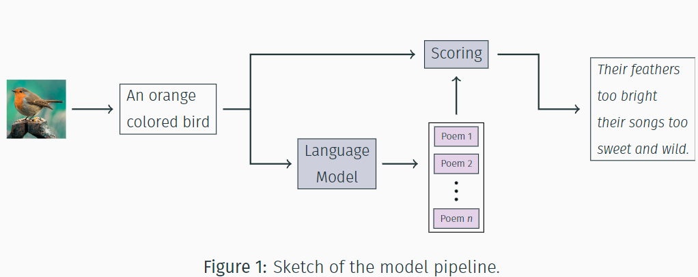

# image-to-poem

A repository for generating poems from images using the pipeline depicted in figure 1.





## Installation

The `image-to-poem` package can be installed by cloning this repository and running the following command in the root directory:

```bash
pip install .
```

## Usage

The `image-to-poem` package can be used to generate poems from images. The following command can be used to generate a poem from an image:

```python
from image_to_poem import PoemGenerator

poem_generator = PoemGenerator(
    lm_model = "path/to/language_model",
    sim_model = "path/to/similarity_model",
    n_candidates = 5,
)

poem = poem_generator.image_to_poem("path/to/image")
```


### Training a language model

To train a language model, start by unzipping the dataset:

```bash
unzip data/kaggle_poems.zip
```

Then, train the language model  by running the `Trainer.train()` method found in `image_to_poem/language_model/trainer.py`. This has been set up in `image_to_poem/language_model/trainer.py` where training parameters can also be changed.


### Training a similarity model

## Demo 

After acquiring the trained language and similarity models, the `image-to-poem` package can be used to generate poems from images. The functionality of the package is demonstrated in the `notebooks/demo.ipynb` notebook.